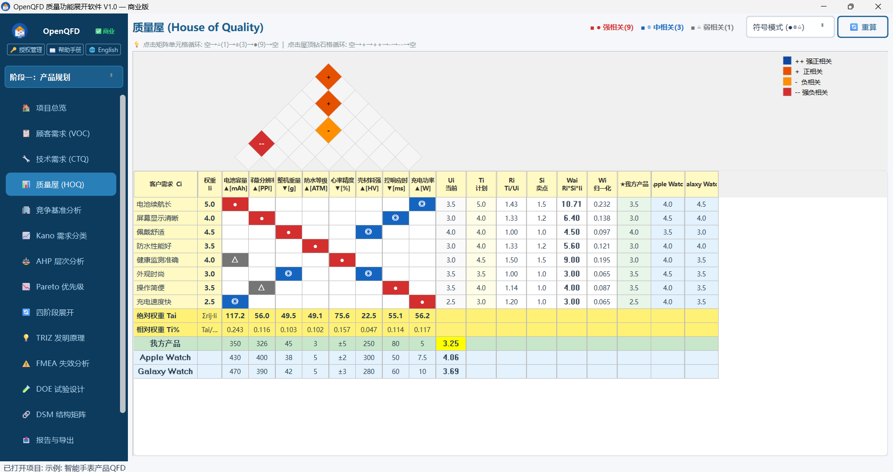

# OpenQFD — 质量功能展开软件 V1.0

<p align="center">
  <br>
  <b>Quality Function Deployment</b> — 将顾客之声系统转化为设计参数<br>
  基于 PySide6 的桌面端 QFD 分析平台，集成 VOC/CTQ/HOQ/KANO/AHP/Pareto/TRIZ/FMEA/DOE/DSM/竞争分析/版本管理/四阶段质量工具
</p>
<p align="center">
    
</p>
---

## 版本说明

| | 免费版 | 商业版 |
|---|---|---|
| VOC 顾客需求管理 | ✅ | ✅ |
| CTQ 技术需求管理 | ✅ | ✅ |
| **质量屋 HOQ (一体化七区)** | ✅ | ✅ |
| 项目管理 / 示例项目 | ✅ | ✅ |
| PNG 图片导出 | ✅ | ✅ |
| **竞争基准分析 (雷达图/柱状图)** | ✅ | ✅ |
| Kano 需求分类 | 🔒 | ✅ |
| AHP 层次分析法 | 🔒 | ✅ |
| Pareto 优先级分析 | 🔒 | ✅ |
| 四阶段 QFD 级联展开 | 🔒 | ✅ |
| **TRIZ 发明原理 + 矛盾矩阵** | 🔒 | ✅ |
| **FMEA 失效模式分析 (RPN)** | 🔒 | ✅ |
| **DOE 试验设计 (全因子/正交表)** | 🔒 | ✅ |
| **DSM 设计结构矩阵** | 🔒 | ✅ |
| 完整导出 (Excel/CSV/JSON) | 🔒 | ✅ |
| 版本控制 (快照/回滚) | 🔒 | ✅ |

购买商业版授权码: 📱 **13301707703（微信同号）**

---

## 快速开始

dist\OpenQFD.exe  (双击直接运行)

### 自动部署（推荐）

**Windows:**
```
1. 解压 OpenQFD.zip
2. 右键 setup_windows.ps1 → 使用 PowerShell 运行
3. 双击桌面「OpenQFD」图标启动
```

**Linux / macOS:**
```bash
unzip OpenQFD.zip && cd OpenQFD
chmod +x setup_unix.sh && ./setup_unix.sh
./qfd.sh
```

### 手动部署

```bash
cd OpenQFD
python -m venv .venv
# Windows:    .venv\Scripts\Activate.ps1
# Linux/Mac:  source .venv/bin/activate
pip install -r requirements.txt
python main.py
```

> 详细部署/卸载说明见 [DEPLOY.md](DEPLOY.md)

---

## 功能一览

### 质量屋 HOQ（一体化七区视图）
屋顶(相关矩阵) + 天花板(CTQ) + 左墙(VOC) + 房间(关系矩阵) + 右墙(竞争评估) + 地板(技术重要度) + 地下室(竞品基准)

### VOC / CTQ 管理
三级树状嵌套、Excel/CSV导入、Kano分类、重要度评分

### 高级分析（商业版）
- **竞争基准**: 雷达图 + 柱状对比
- **Kano**: 五类分类、象限图、自动建议
- **AHP**: 成对比较 + 一致性检验 (CR<0.1)
- **Pareto**: 柱状图 + 累计曲线 + 二八法则

### TRIZ 发明原理（商业版）
- 40条发明原理浏览器（中英双语）
- 39个工程参数矛盾矩阵查询
- 选择"改善参数"和"恶化参数"自动推荐发明原理

### FMEA 失效分析（商业版）
- DFMEA / PFMEA 工作表
- S×O×D 自动计算 RPN 值
- 风险等级色标: 红(≥200) / 橙(≥100) / 黄(≥50) / 绿(<50)
- 从 HOQ 一键导入高优先级 CTQ
- CSV 导出 FMEA 报告

### DOE 试验设计（商业版）
- 因子定义 (2-5因子，每因子2-5水平)
- 全因子设计自动生成
- L8正交表 (部分因子设计)
- 试验方案表 CSV 导出

### DSM 设计结构矩阵（商业版）
- N×N 依赖关系矩阵 (点击标记 X 依赖)
- 从 CTQ 一键导入元素
- 结构分析: 耦合检测、独立元素识别、密度统计
- CSV 矩阵导出

### 四阶段展开（商业版）
产品规划 → 零件展开 → 工艺规划 → 生产控制，一键级联

### 导出与版本
Excel多Sheet、PNG/SVG、FMEA CSV、JSON备份、版本快照回滚

---

## 授权管理

### 在线云端验证
采用腾讯云函数在线验证，激活后支持 30 天离线使用。
**不绑定电脑**——同一授权码可在任意设备上激活。

### 激活步骤
1. 点击侧栏 **🔑 授权管理**
2. 输入授权码 `OQFD-XXXX-XXXX-XXXX-XXXX`
3. 点击激活，重启即可

---

## 项目结构

```
OpenQFD/
├── main.py                     # 主程序入口
├── requirements.txt            # Python 依赖
├── setup_windows.ps1           # Windows 自动部署
├── setup_unix.sh               # Linux/macOS 自动部署
├── build_installer.py          # PyInstaller 打包


├── cloud/
│   └── index.py                # 腾讯云函数授权服务
├── assets/                     # 图标和Logo
├── models/
│   ├── database.py             # SQLite 数据层
│   └── license.py              # 云端授权客户端
├── engines/
│   └── compute.py              # HOQ / AHP / Kano 引擎
├── views/
│   ├── hoq_view.py             # 质量屋一体化视图
│   ├── voc_view.py / ctq_view.py
│   ├── competition_view.py     # 竞争分析
│   ├── analysis_views.py       # AHP / Kano / Pareto
│   ├── phase_view.py           # 四阶段展开
│   ├── triz_view.py            # TRIZ 发明原理
│   ├── fmea_view.py            # FMEA 失效分析
│   ├── doe_view.py             # DOE 试验设计
│   ├── dsm_view.py             # DSM 结构矩阵
│   ├── export_view.py          # 导出和版本
│   ├── help_view.py            # 帮助手册
│   └── styles.py               # UI 样式
└── utils/
    ├── fonts.py                # 中文字体配置
    └── i18n.py                 # 国际化 (中/英)
```

---

© 2026 OpenQuality · 13301707703（微信同号）
