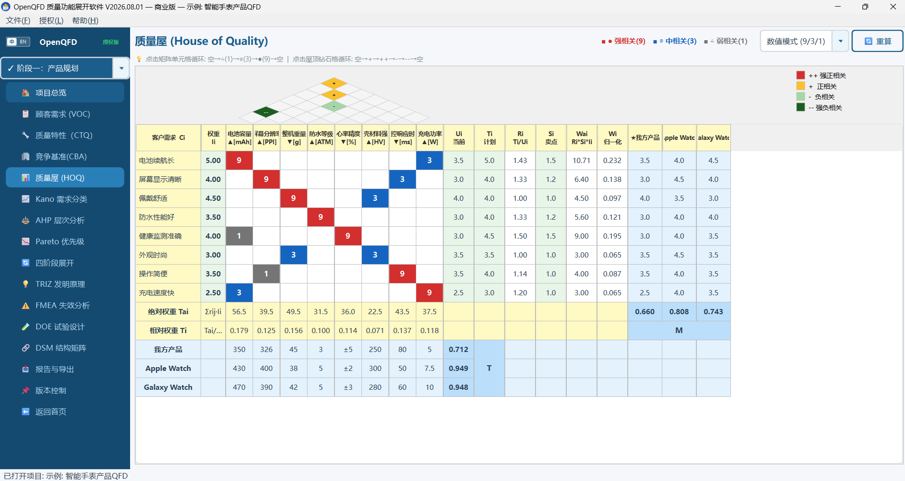

# OpenQFD — 质量功能展开软件 v2026.08.01

<p align="center">
  <br>
  <b>Quality Function Deployment</b> — 将顾客之声系统转化为设计参数<br>
  基于 PySide6 的桌面端 QFD 分析平台，集成 Kano / AHP / Pareto / TRIZ / FMEA / DOE / DSM 质量工具<br>
  支持中文 / English 双语界面
</p>

---

## 下载

免安装 Python 环境的预编译一键运行包（Windows / macOS / Linux）请前往：

**[GitHub Releases](https://github.com/OpenQuality/OpenQFD/releases/latest)**

| 平台 | 文件 | 运行方式 |
|---|---|---|
| Windows | `OpenQFD-windows.zip` | 解压后双击 `OpenQFD.exe` |
| macOS | `OpenQFD-macos.zip` | 解压后双击 `OpenQFD.app`（首次打开需在「系统设置 → 隐私与安全性」允许） |
| Linux | `OpenQFD-linux.zip` | 解压后 `chmod +x OpenQFD && ./OpenQFD` |

不想用预编译包，或想直接跑源码，见下方「快速开始」。

---

## 界面预览



*质量屋 HOQ 一体化七区视图，示例项目：智能手表产品 QFD*

---

## 核心特性

- 🏠 **质量屋 HOQ 一体化七区视图**：顾客需求、技术特性、关系矩阵、相关矩阵、竞争评估、技术重要度、竞品基准同屏展示，点击循环切换关系强度
- 📋 **VOC / CTQ 全流程管理**：三级树状嵌套结构、Excel/CSV 导入、Kano 分类联动、重要度评分
- 📊 **CBA 竞争基准分析**：雷达图 + 柱状对比，多竞品横向评估
- 🎯 **Kano 需求分类**：五类分类（魅力/期望/必备/无差异/反向）、象限图、自动建议
- 📐 **AHP 层次分析法**：成对比较矩阵、一致性检验 (CR<0.1)
- 📈 **Pareto 优先级分析**：柱状图 + 累计曲线，二八法则自动定位关键少数
- 🔄 **四阶段 QFD 级联展开**：产品规划 → 零件展开 → 工艺规划 → 生产控制，一键级联传递权重
- 💡 **TRIZ 发明原理**：40 条发明原理浏览器（中英双语）、39×39 工程参数矛盾矩阵查询，按"改善参数/恶化参数"自动推荐原理
- ⚠️ **FMEA 失效模式分析**：DFMEA / PFMEA 工作表，S×O×D 自动计算 RPN，风险等级色标（红≥200 / 橙≥100 / 黄≥50 / 绿<50），从 HOQ 一键导入高优先级 CTQ
- 🧪 **DOE 试验设计**：2-5 因子 × 2-5 水平定义，全因子设计自动生成，L8 正交表（部分因子设计）
- 🔗 **DSM 设计结构矩阵**：N×N 依赖关系矩阵，点击标记依赖，耦合检测/独立元素识别/密度统计
- 🗂️ **版本管理**：项目快照与回滚，多个示例项目自动编号，菜单内「切换项目」快捷列表
- 🌐 **中英文双语界面**：侧栏 中/EN 分段按钮一键切换，全部模块/菜单/导出内容同步翻译，切换即时生效无需重启
- 📤 **多格式导出**：Excel 多 Sheet、PNG/SVG 图片、FMEA/DOE/DSM CSV 报告、JSON 项目备份
- 🔑 **三级授权体系**：免费版 / 授权版（关注公众号免费获取）/ 商业版（付费购买，含商用许可与售后），云端在线验证一码一机，激活/解绑即时生效无需重启

---

## 版本说明

| | 免费版 | 授权版 |
|---|---|---|
| VOC 顾客需求管理 | ✅ | ✅ |
| CTQ 技术需求管理 | ✅ | ✅ |
| **质量屋 HOQ (一体化七区)** | ✅ | ✅ |
| 项目管理 / 示例项目 | ✅ | ✅ |
| PNG 图片导出 | ✅ | ✅ |
| **竞争基准分析 CBA (雷达图/柱状图)** | ✅ | ✅ |
| Kano 需求分类 | 🔒 | ✅ |
| AHP 层次分析法 | 🔒 | ✅ |
| Pareto 优先级分析 | 🔒 | ✅ |
| 四阶段 QFD 级联展开 | 🔒 | ✅ |
| **TRIZ 发明原理 + 矛盾矩阵** | 🔒 | ✅ |
| **FMEA 失效模式分析 (RPN)** | 🔒 | ✅ |
| **DOE 试验设计 (全因子/正交表)** | 🔒 | ✅ |
| **DSM 设计结构矩阵** | 🔒 | ✅ |
| 完整导出 (Excel/CSV/JSON) | 🔒 | ✅ |
| 版本管理 (快照/回滚) | 🔒 | ✅ |

获取授权码请打开软件内「授权 → 授权管理」页面查看联系方式（授权版关注微信公众号「OpenQuality」免费领取；商业版请联系 021-58108606）。

---

## 快速开始

### 自动部署（推荐）

**Windows:**
```
1. 解压 OpenQFD.zip
2. 右键 setup_windows.ps1 → 使用 PowerShell 运行
3. 双击桌面「OpenQFD」图标启动
```

**Linux / macOS:**
```bash
unzip OpenQFD.zip && cd OpenQFD
chmod +x setup_unix.sh && ./setup_unix.sh
./qfd.sh
```

### 手动部署

```bash
cd OpenQFD
python -m venv .venv
# Windows:    .venv\Scripts\Activate.ps1
# Linux/Mac:  source .venv/bin/activate
pip install -r requirements.txt
python main.py
```

> 详细部署/卸载说明见 [DEPLOY.md](DEPLOY.md)

---

## 功能一览

### VOC 顾客需求管理
三级树状嵌套结构、Excel/CSV 导入、Kano 分类联动、重要度评分

### CTQ 技术特性管理
三级树状嵌套结构、与 VOC 关系矩阵联动、单位与目标值管理

### CBA 竞争基准分析
雷达图 + 柱状对比，多竞品横向评估，联动质量屋右墙展示

### HOQ 质量屋（一体化七区视图）
屋顶(相关矩阵) + 天花板(CTQ) + 左墙(VOC) + 房间(关系矩阵) + 右墙(竞争评估) + 地板(技术重要度) + 地下室(竞品基准)

### Kano 需求分类
五类分类（魅力/期望/必备/无差异/反向）、象限图、自动建议

### AHP 层次分析法
成对比较矩阵、一致性检验 (CR<0.1)

### Pareto 优先级分析
柱状图 + 累计曲线 + 二八法则

### TRIZ 发明原理
- 40 条发明原理浏览器（中英双语）
- 39 个工程参数矛盾矩阵查询
- 选择"改善参数"和"恶化参数"自动推荐发明原理

### FMEA 失效分析
- DFMEA / PFMEA 工作表
- S×O×D 自动计算 RPN 值
- 风险等级色标: 红(≥200) / 橙(≥100) / 黄(≥50) / 绿(<50)
- 从 HOQ 一键导入高优先级 CTQ
- CSV 导出 FMEA 报告

### DOE 试验设计
- 因子定义 (2-5因子，每因子2-5水平)
- 全因子设计自动生成
- L8正交表 (部分因子设计)
- 试验方案表 CSV 导出

### DSM 设计结构矩阵
- N×N 依赖关系矩阵 (点击标记 X 依赖)
- 从 CTQ 一键导入元素
- 结构分析: 耦合检测、独立元素识别、密度统计
- CSV 矩阵导出

### 四阶段展开
产品规划 → 零件展开 → 工艺规划 → 生产控制，一键级联

### 版本管理
项目快照与回滚，多个示例项目自动编号，菜单内「切换项目」快捷列表

### 导出
Excel 多 Sheet、PNG/SVG、FMEA/DOE/DSM CSV、JSON 项目备份

---

## 授权管理

### 在线云端验证
采用云函数在线验证，激活后支持 30 天离线使用。
**一码一机**——授权码激活时绑定当前设备，如需更换设备，请先在旧设备「取消激活」后再到新设备激活。

### 激活步骤
1. 点击菜单栏 **授权 → 授权管理...**
2. 输入授权码 `OQFD-XXXX-XXXX-XXXX-XXXX`
3. 点击激活，界面立即刷新生效（无需重启）

---

## 项目结构

```
OpenQFD/
├── main.py                     # 主程序入口
├── LICENSE.md                  # 软件许可协议全文
├── requirements.txt            # Python 依赖
├── setup_windows.ps1           # Windows 自动部署
├── setup_unix.sh               # Linux/macOS 自动部署
├── build_installer.py          # PyInstaller 打包（Windows/macOS/Linux）
├── assets/                     # 图标和Logo
├── models/
│   ├── database.py             # SQLite 数据层
│   ├── license.py              # 云端授权客户端
│   └── settings.py             # 本地设置持久化（语言/上次项目等）
├── engines/
│   └── compute.py              # HOQ / AHP / Kano 引擎
├── views/
│   ├── hoq_view.py             # 质量屋一体化视图
│   ├── voc_view.py / ctq_view.py
│   ├── competition_view.py     # 竞争分析 (CBA)
│   ├── analysis_views.py       # AHP / Kano / Pareto
│   ├── phase_view.py           # 四阶段展开
│   ├── triz_view.py            # TRIZ 发明原理
│   ├── fmea_view.py            # FMEA 失效分析
│   ├── doe_view.py             # DOE 试验设计
│   ├── dsm_view.py             # DSM 结构矩阵
│   ├── export_view.py          # 导出和版本
│   ├── help_view.py            # 帮助手册
│   ├── welcome_view.py         # 首页欢迎海报
│   └── styles.py               # UI 样式
└── utils/
    ├── fonts.py                # 中文字体配置
    └── i18n.py                 # 国际化 (中/英)
```

---

© 2026 OpenQuality · 微信公众号「OpenQuality」
